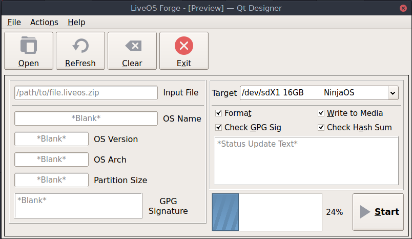

# ninjaforge-ng

Enhanced re-write of ninjaforge.sh in python. WORK IN PROGRESS.

NOTE: Versioning code structures have been added. It is not far enough to start
with semantic versioning, and shall be at version 0.0.0 as a placeholder until
such time there is

Ninja Forge was the half of the clone and forge frame work. Forge re-constitutes
previously made Ninja OS packages, both ones that use the .liveos.zip packages.

The original ninjaforge.sh is written in shell, that provides an easy installer
for Ninja OS, this is a re-write in python, with additonal GUI.

We aim for this to be cross platform running on anything python does. It will
also be a seperate package designed to be installed and used seperately of
Ninja OS.

This program utilizes the .liveos.zip package format. liveos.zips are loaded
and written to flash disks.

.liveos.zip is a structured zip file that has a bootloader, partition image,
index file with metadata and hash and GPG verification, as well as other erta.

Full format spec in Docs/

notable files:

Python Library
-------
ninjaos_common.py

Forge GUI
---------
ninjaforge\_gui.py
ninjaforge\_qt5.ui
ninjaforge\_about.ui

Screenshot:

Forge CLI
---------
TBD
